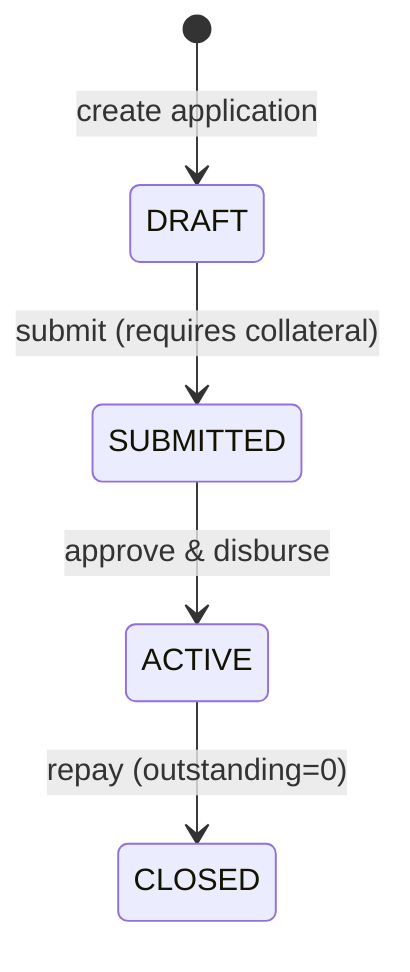
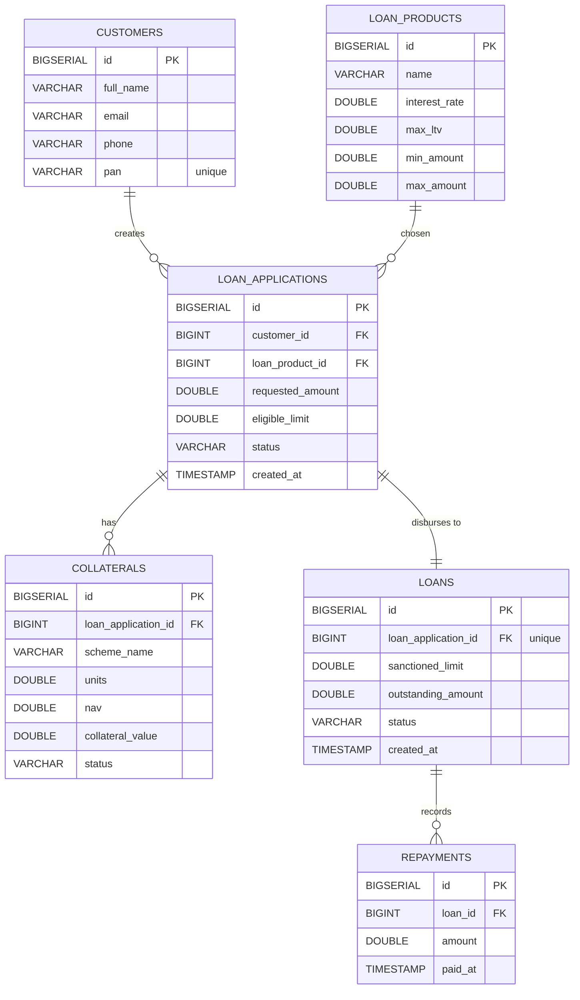

# Loan Management System (LAMF LMS)

<p align="center">
  
</p>

Java full-stack **Loan Against Mutual Funds (LAMF)** demo project:

- **Admin dashboard** (HTML + Bootstrap + JS) to manage Products -> Applications -> Collateral -> Loans -> Repayments
- **Spring Boot API** secured with **JWT** for internal `/api/**` routes
- **Partner API** secured with **X-API-KEY** for `/partner/**` routes
- **PostgreSQL** schema + seed data for instant demo

---

## Table of Contents

- [What's in this project](#whats-in-this-project)
- [Tech stack](#tech-stack)
- [Workflow (charts)](#workflow-charts)
- [Architecture](#architecture)
- [Schema (ER diagram)](#schema-er-diagram)
- [Setup + run (end-to-end)](#setup--run-end-to-end)
  - [Backend run steps](#backend-run-steps)
  - [Frontend run steps](#frontend-run-steps)
- [Environment / config](#environment--config)
- [API reference](#api-reference)
  - [Auth (login)](#auth-login)
  - [Products](#products)
  - [Applications](#applications)
  - [Loans](#loans)
  - [Collaterals](#collaterals)
  - [Partner API](#partner-api)
- [Postman / curl](#postman--curl)
- [Deployment](#deployment)

---

## What's in this project

**Folder structure**

- `Backend/` -- Spring Boot + Spring Security + JWT + PostgreSQL
- `Frontend/` -- static HTML/Bootstrap/JS dashboard (no Node build step)

**Key behavior**

- Customers are created/identified by `pan` when an application is created (no separate customer portal).
- Application eligibility is computed from collateral: `eligibleLimit = sum(units * nav) * maxLtv`.
- Approve/disburse is **idempotent** (safe to retry without creating duplicate loans).

## Tech stack

- Backend: Spring Boot, Spring Web, Spring Data JPA, Spring Security, JWT (`jjwt`)
- Database: PostgreSQL
- Frontend: HTML, Bootstrap 5, Vanilla JS
- Deployment (recommended): Render/Railway for backend + DB, Vercel/Netlify for frontend

## Workflow (charts)

### Loan lifecycle (state)



### End-to-end flow (from UI + partner)

```mermaid
flowchart LR
  subgraph Frontend[Admin UI (Frontend/)]
    Login[login.html] --> Dash[dashboard.html]
  end

  subgraph Backend[Spring Boot API (localhost:8080)]
    Auth[/POST /auth/login/]
    Products[/GET|POST /api/products/]
    Apps[/POST /api/applications .../]
    Colls[/GET /api/collateral .../]
    Loans[/GET|POST /api/loans .../]
    Partner[/POST /partner/v1/loan-applications/]
  end

  subgraph DB[(PostgreSQL)]
    Tables[(schema.sql)]
  end

  Login -->|username+password| Auth
  Dash -->|Bearer JWT| Products
  Dash -->|Bearer JWT| Apps
  Dash -->|Bearer JWT| Colls
  Dash -->|Bearer JWT| Loans
  Partner -->|X-API-KEY| Partner
  Backend --> DB
```

## Architecture

### Auth model

- **Admin dashboard auth**: `POST /auth/login` returns a JWT. The frontend stores it in `localStorage` as `LAMF_JWT` and sends it as `Authorization: Bearer <token>` for all `/api/**` calls.
- **No public register**: this is an admin-only workflow tool (like an NBFC/NBFI ops dashboard). Borrowers/customers do not log in; they're created during application creation (`pan` acts as a unique identifier).
- **Partner auth**: partner endpoints live under `/partner/**` and require `X-API-KEY` (validated against the `api_clients` table).

### Idempotency note (approve/disburse)

`POST /api/applications/{id}/approve-disburse` is **idempotent**: if the loan for that application already exists, the service returns the existing loan instead of creating a duplicate. This handles retries / double-clicks safely.

## Schema (ER diagram)

Source of truth:

- `Backend/src/main/resources/schema.sql`
- `Backend/src/main/resources/data.sql` (seed data)



Relationship summary (as required):

- Customer -> Application: `customers (1) -> loan_applications (many)`
- Application -> Collateral: `loan_applications (1) -> collaterals (many)`
- Application -> Loan: `loan_applications (1) -> loans (0/1)`
- Loan -> Repayment: `loans (1) -> repayments (many)`

---

## Setup + run (end-to-end)

### Prerequisites

- Java `21` (see `Backend/pom.xml`)
- PostgreSQL `14+`

### Backend run steps

1) Create a database (default name is `loanManagement`):

```sql
CREATE DATABASE "loanManagement";
```

2) Configure DB + secrets in `Backend/src/main/resources/application.properties` (see [Environment / config](#environment--config)).

3) Run backend:

```bash
cd Backend
./mvnw spring-boot:run
```

Backend starts at `http://localhost:8080`.

Important: this project runs `schema.sql` + `data.sql` on startup (`spring.sql.init.mode=always`) which **drops and recreates tables** for a clean demo run.

### Frontend run steps

This is a static frontend (no build). Start any static server in `Frontend/`:

```bash
cd Frontend
python -m http.server 5500
```

Then open:

- `http://localhost:5500/index.html`
- Login: `admin` / `admin123`

If your backend isn't on `http://localhost:8080`, update `Frontend/assets/js/config.js`.

---

## Environment / config

Configured in `Backend/src/main/resources/application.properties` (or overridden via environment variables in production).

**Database**

- `spring.datasource.url` (env: `SPRING_DATASOURCE_URL`)
- `spring.datasource.username` (env: `SPRING_DATASOURCE_USERNAME`)
- `spring.datasource.password` (env: `SPRING_DATASOURCE_PASSWORD`)

**JWT**

- `app.jwt.secret` (must be **>= 32 chars**, env: `APP_JWT_SECRET`)
- `app.jwt.expiration-minutes` (env: `APP_JWT_EXPIRATION_MINUTES`)

**Demo admin login**

- `app.admin.username` (env: `APP_ADMIN_USERNAME`)
- `app.admin.password` (env: `APP_ADMIN_PASSWORD`)

**Partner API**

- `app.partner.api-key-header` (default `X-API-KEY`, env: `APP_PARTNER_API_KEY_HEADER`)
- Partner keys live in DB table `api_clients` (seeded in `Backend/src/main/resources/data.sql`)

---

## API reference

Base URL: `http://localhost:8080`

Error response format (example):

```json
{ "message": "requestedAmount must be > 0", "status": 400 }
```

### Auth (login)

`POST /auth/login` (public)

Request:

```json
{ "username": "admin", "password": "admin123" }
```

Response:

```json
{ "token": "eyJhbGciOiJIUzI1NiJ9..." }
```

Use this token as:

`Authorization: Bearer <token>`

Note: `POST /auth/register` exists in code, but this project intentionally does not provide public user registration (see [Architecture](#architecture)).

### Products

Auth: **JWT required**

- `GET /api/products` -- list products
- `POST /api/products` -- create product

Create request:

```json
{
  "name": "LAMF Overdraft",
  "interestRate": 14.5,
  "maxLtv": 0.5,
  "minAmount": 10000,
  "maxAmount": 500000
}
```

Example response:

```json
{
  "id": 1,
  "name": "LAMF Overdraft",
  "interestRate": 14.5,
  "maxLtv": 0.5,
  "minAmount": 10000.0,
  "maxAmount": 500000.0
}
```

### Applications

Auth: **JWT required**

- `POST /api/applications` -- create application (creates/links customer by `pan`)
- `GET /api/applications` -- list applications
- `POST /api/applications/{id}/collateral` -- add collateral (MF units + NAV)
- `POST /api/applications/{id}/submit` -- submit for approval (requires >=1 collateral)
- `POST /api/applications/{id}/approve-disburse` -- approve + pledge collateral + create loan (**idempotent**)

Create request:

```json
{
  "fullName": "Rahul Sharma",
  "email": "rahul@example.com",
  "phone": "9999999991",
  "pan": "ABCDE1234F",
  "loanProductId": 1,
  "requestedAmount": 80000
}
```

Create response (example):

```json
{
  "id": 10,
  "customer": { "id": 1, "fullName": "Rahul Sharma", "email": "rahul@example.com", "phone": "9999999991", "pan": "ABCDE1234F" },
  "loanProduct": { "id": 1, "name": "LAMF Overdraft", "interestRate": 14.5, "maxLtv": 0.5, "minAmount": 10000.0, "maxAmount": 500000.0 },
  "requestedAmount": 80000.0,
  "eligibleLimit": 0.0,
  "status": "DRAFT",
  "createdAt": "2025-12-21T10:15:30.123"
}
```

Add collateral request:

```json
{ "schemeName": "HDFC Flexi Cap Fund", "units": 300, "nav": 220 }
```

Add collateral response (example):

```json
{
  "id": 21,
  "schemeName": "HDFC Flexi Cap Fund",
  "units": 300.0,
  "nav": 220.0,
  "collateralValue": 66000.0,
  "status": "UNPLEDGED",
  "applicationId": 10
}
```

Approve/disburse response (creates a loan):

```json
{
  "id": 7,
  "loanApplication": { "id": 10, "status": "ACTIVE", "requestedAmount": 80000.0, "eligibleLimit": 33000.0, "customer": { "id": 1, "fullName": "Rahul Sharma", "pan": "ABCDE1234F" }, "loanProduct": { "id": 1, "name": "LAMF Overdraft", "maxLtv": 0.5 } },
  "sanctionedLimit": 33000.0,
  "outstandingAmount": 33000.0,
  "status": "ACTIVE",
  "createdAt": "2025-12-21T10:25:11.123"
}
```

### Loans

Auth: **JWT required**

- `GET /api/loans/active` -- list active loans
- `POST /api/loans/{loanId}/repay` -- record repayment (reduces outstanding, closes at 0)
- `GET /api/loans/{loanId}/repayments` -- list repayments for a loan

Repay request:

```json
{ "amount": 10000 }
```

Repayments response (example):

```json
[{ "id": 1, "amount": 10000.0, "paidAt": "2025-12-21T10:30:00Z" }]
```

### Collaterals

Auth: **JWT required**

- `GET /api/collateral` -- list all collaterals
- `GET /api/collateral/by-application/{applicationId}` -- list collaterals for an application

### Partner API

Auth: **X-API-KEY required** (no JWT)

- `POST /partner/v1/loan-applications`

Headers:

- `X-API-KEY: DEMO_PARTNER_KEY_123` (seeded demo key)

Request body is the same as "Create application":

```json
{
  "fullName": "Fintech User",
  "email": "user@fintech.com",
  "phone": "9000000000",
  "pan": "FINTE1234Z",
  "loanProductId": 1,
  "requestedAmount": 90000
}
```

---

## Postman / curl

### Curl quickstart

1) Login (get JWT):

```bash
curl -s -X POST http://localhost:8080/auth/login \
  -H "Content-Type: application/json" \
  -d "{\"username\":\"admin\",\"password\":\"admin123\"}"
```

2) List products (JWT required):

```bash
curl -s http://localhost:8080/api/products \
  -H "Authorization: Bearer <TOKEN>"
```

3) Partner create application (API key required):

```bash
curl -s -X POST http://localhost:8080/partner/v1/loan-applications \
  -H "Content-Type: application/json" \
  -H "X-API-KEY: DEMO_PARTNER_KEY_123" \
  -d "{\"fullName\":\"Fintech User\",\"email\":\"user@fintech.com\",\"phone\":\"9000000000\",\"pan\":\"FINTE1234Z\",\"loanProductId\":1,\"requestedAmount\":90000}"
```

### Postman collection

- Collection file: `postman/LAMF-LMS.postman_collection.json`
  - Variables: `baseUrl`, `jwt`, `partnerKey`

---

## Deployment

### Backend (Render / Railway / Fly.io)

- Build: `./mvnw -DskipTests package`
- Start: `java -jar target/LMS-0.0.1-SNAPSHOT.jar`
- Set env vars (recommended):
  - `SPRING_DATASOURCE_URL`, `SPRING_DATASOURCE_USERNAME`, `SPRING_DATASOURCE_PASSWORD`
  - `APP_JWT_SECRET` (>= 32 chars)
- Production note: set `spring.sql.init.mode=never` (otherwise startup will drop/recreate tables).

### Frontend (Vercel / Netlify)

This is static HTML. Deploy the `Frontend/` folder and set backend URL:

- Update `Frontend/assets/js/config.js` -> `BASE_URL: "https://<your-backend>"`

